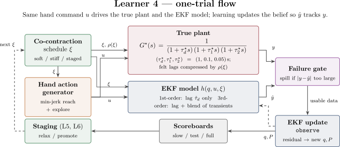
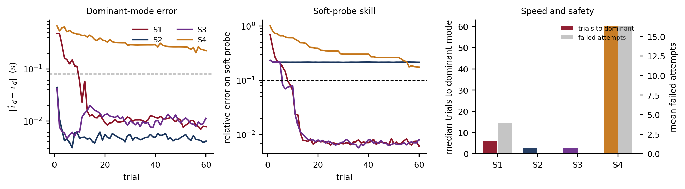
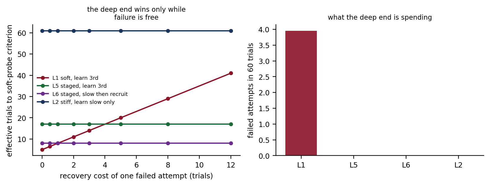
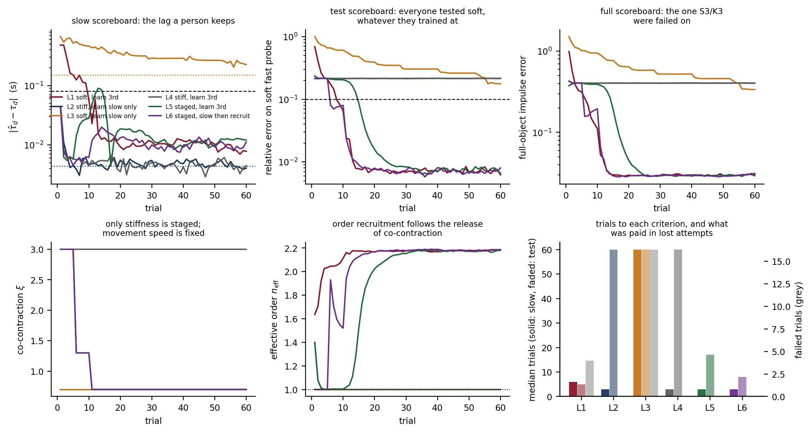

# order-reduction-sim

Digital-twin check of **co-contraction as a learning strategy**, written for the
Royal Society URF proposal *Tuning to Learn* (MV1: twin check).

> **The learner in the proposal is Learner 4** (`scripts/run_learner4.*`).
> Proposal labels **S1–S4** are a subset of code conditions **L1–L6**.
> Learners 1–3 are earlier development runs; they are **not** cited in the
> proposal figure or MV1 text.

| Doc | Link |
|-----|------|
| **Implementation (Learner 4)** | [`IMPLEMENTATION.md`](IMPLEMENTATION.md) — plant, hand motion, EKF, loop |
| **Short presentation** | [`outputs/learner4/learner4_slides.pdf`](outputs/learner4/learner4_slides.pdf) — Beamer deck |
| **Theory PDF** | [`report/theory.pdf`](report/theory.pdf) — \(\rho(\xi)\), bias law, derivations |
| **Other learners (1–3)** | [`OTHER_LEARNERS.md`](OTHER_LEARNERS.md) |

---

## How Learner 4 works (one-trial block diagram)



Vector source: [`learner-4-block-diagram-aranged.svg`](outputs/learner4/learner-4-block-diagram-aranged.svg).

**Small reading of the diagram.** Each trial is one pass around this loop:

1. **Co-contraction schedule \(\xi\)** chooses soft, braced, or staged grip (and,
   for L5/L6, when to relax / promote).
2. **Hand action generator** builds a fixed-duration min-jerk out-and-back reach
   plus band-limited exploration — the same movement class a limb can actually
   produce.
3. That command \(u\) drives both the **true plant**
   \(G^*(s)=1/((1+\tau_d^*s)(1+\tau_1^*s)(1+\tau_2^*s))\) (felt fast lags
   compressed by \(\rho(\xi)\)) and the **EKF model** \(h(q,u,\xi)\) (first-order
   on \(\hat\tau_d\) only, or full third-order with blended transients).
4. A **failure gate** aborts the trial if \(|y-\hat y|\) is too large (“spill”);
   otherwise the **EKF update** turns the residual into a new belief \(q,P\).
5. **Scoreboards** (slow / soft-probe test / full object) decide trials-to-criterion;
   staged conditions feed confidence back into \(\xi\).

Full walkthrough of every block (equations, hyperparameters, code paths):
**[`IMPLEMENTATION.md`](IMPLEMENTATION.md)**.  
Slide version of the same story:
**[view the short presentation (PDF)](outputs/learner4/learner4_slides.pdf)**.

---

## Proposal mapping (read this first)

The proposal (MV1) compares four strategies on a fixed third-order cup-like
plant, with **movement speed held fixed** so only co-contraction and model
capacity change:

| Proposal | Code | Strategy (proposal wording) |
|----------|------|-----------------------------|
| **S1** | **L1** | Soft from trial 1 with a **full** model |
| **S2** | **L2** | Braced throughout, learning **only the dominant dynamics** |
| **S3** | **L6** | Braced first, then **staged release** into a full soft model (warm-start hand-over) |
| **S4** | **L3** | Soft like S1, but **forced** to learn only the dominant dynamics (control) |

Extra code cells **L4** / **L5** are factorial controls (filter without
restriction; staged full-order without explicit warm-start). They support the
claim but are **not** drawn in the proposal panel.

The estimator is an **extended Kalman filter (EKF)** that updates a belief about
the plant’s time constants from each noisy trial. Soft grip
(\(\xi\approx0.7\)) leaves all three modes visible; braced grip
(\(\xi\approx3\)) compresses the fast time constants by
\(\rho(\xi)=(\xi+\sqrt{\xi^2-1})^2\), so the felt plant collapses toward a
single lag—the filtering story in the proposal.

---

## Regenerate the URF / MV1 figure

```bash
python -m pip install -r requirements.txt
./scripts/run_learner4.sh --trials 60 --seeds 20
# PYTHON=python3 ./scripts/run_learner4.sh --trials 60 --seeds 20
```

| Output | Role |
|--------|------|
| [`outputs/learner4/learner4_proposal.png`](outputs/learner4/learner4_proposal.png) | **Proposal / MV1 panel** (S1–S4) → copy to `urf-proposal/figures/learner4-sim.pdf` |
| [`outputs/learner4/learner4.png`](outputs/learner4/learner4.png) | Full L1–L6 diagnostic |
| [`outputs/learner4/failure_cost.png`](outputs/learner4/failure_cost.png) | Soft-probe cost when spills are not free |
| `outputs/learner4/results.json` | Medians + Holm tests |

Smoke: `./scripts/run_learner4.sh --smoke`.

---

## Results (20 seeds × 60 trials) — aligned with MV1

**Proposal punchline (same as the URF text):** braced strategies reach the
**dominant dynamics** in **half** the trials with **zero** failures; only the
**staged-release** strategy (S3) also passes a later **soft probe**. High
co-contraction forever is not enough: S2 never passes that soft probe. Calling
fast modes “noise” without bracing (S4) fails.

### Proposal figure (S1–S4)



**Left — Dominant-mode error** \(|\hat\tau_d-\tau_d|\).
Braced S2/S3 drop under the 0.08 s criterion immediately; soft full-model S1
gets there later after a large transient error; soft dominant-only S4 never
does (systematic bias ≈ +0.22 s).

**Middle — Soft-probe skill** (everyone scored on the same unbraced fast reach).
S1 and S3 reach ~0.007 relative error. S2 stays stuck ≈ 0.22 (braced forever
never learns the fast wobbles). S4 stays high: omitting modes is only
legitimate once the physical filter is in place.

**Right — Speed and safety.** Median trials to the dominant lag: S1 = 6, S2 = 3,
S3 = 3, S4 = never. Mean failed attempts: S1 ≈ 4, S2/S3 = 0, S4 ≈ 16.
Relative to S1: braced S2/S3 cut trials to the slow lag by **50%**, failed
attempts by **100%**, and peak lag error by ~**97%**—matching the proposal
caption numbers.

### Failure cost (why S3 is the strategy to defend)



If a spilled / aborted attempt costs nothing beyond truncated data, soft S1
(code L1) still wins the soft probe on raw trial count (5 vs 8 for S3). Charge
even **one** recovery trial per failure and S3 (code L6) draws level, then wins,
because it never fails. That is the conditional claim in the longer draft:
co-contraction buys a faster safer route to the dominant dynamics, and—via
staged release—a working path to full soft skill, not a licence to ignore the
rest forever.

### Full diagnostic (all six code conditions)



Use this figure to see the controls the proposal omits: **L4** (stiff + full
EKF) ties S2/L2 on the slow scoreboard—the **plant** does the order reduction,
not a hand-coded capacity limit—and **L5** (staged without warm-start) is
slower than **L6**/S3 on the soft probe, so the value is in **handing over** the
converged slow estimate.

---

## What this repo supports for the proposal

**Claim (MV1 language):**

- Braced strategies reach the dominant dynamics in half the trials with zero
  failures.
- Only staged release (S3) also passes a later soft probe.
- Soft dominant-only (S4) shows that “ignore fast modes” without bracing is
  misspecified, not a shortcut.

**Do not claim:**

- That humans already do this (MV1 is a twin check, not human evidence).
- That staying braced forever yields soft skill (S2 fails the soft probe).
- That staging beats the deep end when spills are free (it does not on raw
  soft-probe trial count).

---

## Other learners (1–3)

Earlier development runs (gradient curriculum, two-timescale EKF, slosh plant).
They tested a stronger sample-complexity reading of the meeting note and are
**not** cited in the URF proposal.

→ **[Other learners — full details](OTHER_LEARNERS.md)**

| Learner | One-line summary | Run |
|---------|------------------|-----|
| **1** | Gradient learner on the three-lag cup; curriculum loses on trials-to-criterion | `./scripts/run_curriculum.sh` |
| **2** | Two-timescale EKF + ARD; misspecification bias law `(tau_1+tau_2)/rho` | `./scripts/run_learner2.sh` |
| **3** | Same EKF idea on a slosh (complex-pole) object | `./scripts/run_learner3.sh` |
